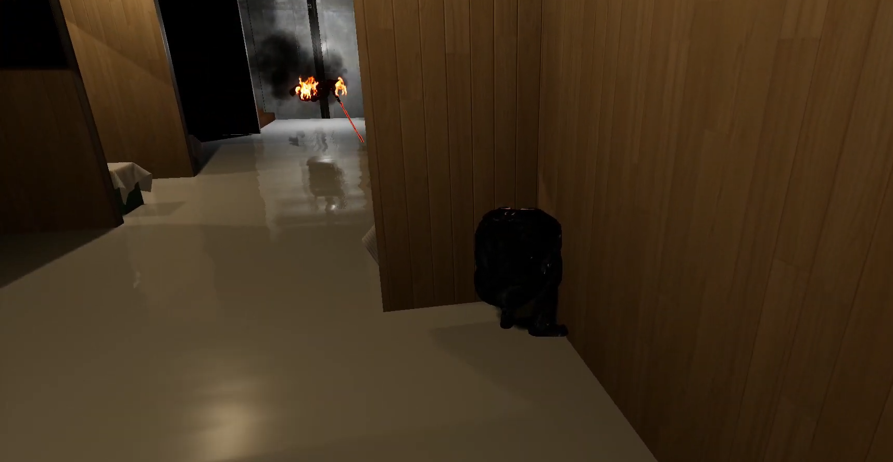

# SwordGame

## Creating A Build

You must have a source build of the engine. This is for building the server target.

First, build each map under "Content/Maps", except for "Content/Maps/LightingScenarios".
- One way to do this is open each one in the editor and "build all levels".
- Alternatively, here's a command to do that: "<editor-exe-path> <uproject-path> -noP4 -AllowCommandletRendering -run=ResavePackages -buildlighting -buildreflectioncaptures -buildtexturestreaming -MAP=UltimateBuildDonut+Door+DoubleHouse+DT+Elevape+EnemyHouse+House+House3+House_2+House_2Big+House_2BigBig+Level1+SSB+Town+TransitionMap+UltimateBuild+Overview+ThirdPersonExampleMap+Modular_interiorsBONUS_demo+Advanced_Lighting+Minimal_Default+StarterMap"
    - This command worked for me except for the Elevape map. I think that might be because I included the lighting scenario levels. Now I removed them from the command but I haven't tried it myself to verify if it works now.
    - Also, this command builds ALL maps - not only the ones under "Content/Maps". This should be corrected.

Open project launcher from the editor and start a build.
1. Create new custom launch profile.
2. Use the following argument values.
    - Build.
        - Ensure "Build Configuration" is set to "Development". Note: We don't use "Test" or "Shipping" because there are important on-screen debug messages for the player to see.
    - Cook.
        - Choose "By the book".
        - Enable "Windows" and "WindowsServer" for "Cooked Platforms".
        - Ensure "En" is enabled for "Cooked Cultures".
        - Select "All" for "Cooked Maps".
    - Package.
        - Choose "Package & store locally".
        - Enable "Include an installer for prerequisites of packaged games".
    - Archive.
        - Enable archiving.
        - Choose a directory to output a copy of the build to. This directory will be your clean build that you can zip and distribute.
        - Please include the commit date and commit hash in the folder name.
        - Current convention for build names: `<game-name>_<commit-date-time>_<commit-hash>`.
            - E.g., "SwordGame_2025-03-22T03-43-17_1cc177907b9f6e9ebcceaf210187cfb1eac88fd7".
    - Deploy.
        - Choose "Do not deploy".
3. Launch the profile.
